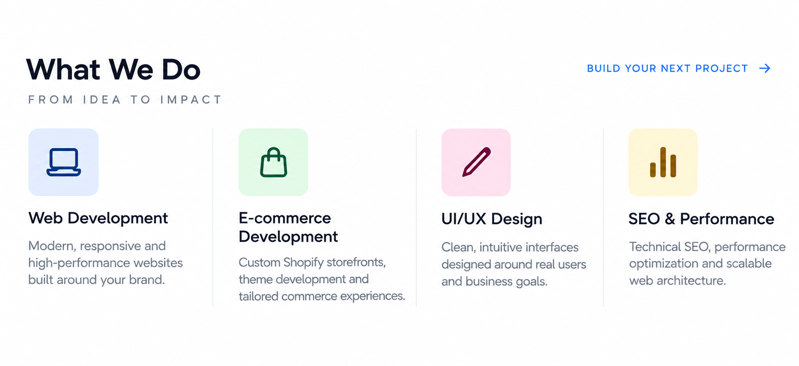

  

<!-- WHAT WE DO -->

  

 

<!-- TECHNOLOGY -->

  

 
---

## Selected Work

### LUMBIA
Premium product showcase and brand experience built with Next.js.

**Next.js · TypeScript · Tailwind CSS · Internationalization**

### Erzenler
Multilingual QR menu and restaurant ordering platform with real-time order management and automatic receipt printing.

**Next.js · Supabase · QR Ordering · Admin Dashboard**

### PINKCORE
Premium Shopify storefront for a women's activewear brand.

**Shopify · Liquid · E-commerce · UI/UX**

---

## Let's Build Something Great

Have a project in mind or looking for a development partner?

**Website:** https://bravixcreative.com  
**Instagram:** https://instagram.com/bravixcreative  
**Email:** bravixcreative@gmail.com

---

Designed & developed by Bravix Creative.
