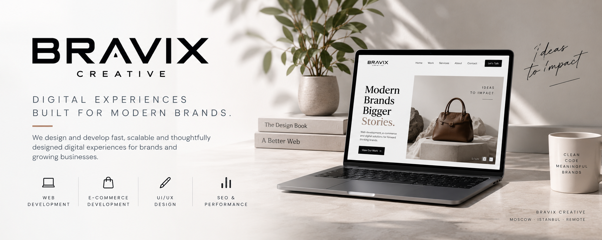
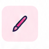
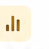

  

<h2>What We Do</h2>

F R O M &nbsp; I D E A &nbsp; T O &nbsp; I M P A C T

<table>
<tr>

<td width="25%" valign="top">

<h3>
<a href="https://bravixcreative.com/en/services/web-development">
Web Development
</a>
</h3>

Modern, responsive and high-performance websites built around your brand.

</td>

<td width="25%" valign="top">

<h3>
<a href="https://bravixcreative.com/services/ecommerce-development">
E-commerce Development
</a>
</h3>

Custom Shopify storefronts, theme development and tailored commerce experiences.

</td>

<td width="25%" valign="top">

<h3>
<a href="https://bravixcreative.com/en/services//ui-ux-design">
UI/UX Design
</a>
</h3>

Clean, intuitive interfaces designed around real users and business goals.

</td>

<td width="25%" valign="top">

<h3>
<a href="https://bravixcreative.com/en/services/seo-optimization">
SEO &amp; Performance
</a>
</h3>

Technical SEO, performance optimization and scalable web architecture.

</td>

</tr>
</table>
---
<!-- TECHNOLOGY -->

<h2>Technology</h2>

M O D E R N &nbsp; T O O L S. &nbsp; B E T T E R &nbsp; S O L U T I O N S.

 

<h4>Core Development</h4>

<h4>Commerce &amp; Backend</h4>

<h4>Platform &amp; Experience</h4>

 

---

<!-- SELECTED WORK -->

<h2>Selected Work</h2>

  R E A L &nbsp; P R O J E C T S. &nbsp; R E A L &nbsp; R E S U L T S.

 

<table>
<tr>

<td width="33%" valign="top">

BRAND EXPERIENCE

<h3><strong>LUMBIA</strong></h3>

Multilingual product experience combining premium visual storytelling
with a refined, high-performance interface.

<code>Next.js</code>
<code>TypeScript</code>
<code>Tailwind CSS</code>
<code>i18n</code>

<a href="PROJECT-URL"><strong>View Project →</strong></a>

</td>

<td width="33%" valign="top">

DIGITAL PLATFORM

<h3><strong>Erzenler</strong></h3>

Multilingual QR ordering platform with real-time order management,
admin tools and automatic receipt printing.

<code>Next.js</code>
<code>Supabase</code>
<code>QR Ordering</code>
<code>Admin</code>

<a href="PROJECT-URL"><strong>View Project →</strong></a>

</td>

<td width="33%" valign="top">

E-COMMERCE

<h3><strong>PINKCORE</strong></h3>

Premium Shopify storefront combining strong brand direction
with a conversion-focused shopping experience.

<code>Shopify</code>
<code>Liquid</code>
<code>E-commerce</code>
<code>UI/UX</code>

<a href="PROJECT-URL"><strong>View Project →</strong></a>

</td>

</tr>
</table>

 

---

<!-- CTA -->

<h2>Let's Build Something Great</h2>

B E T T E R &nbsp; W E B &nbsp; E X P E R I E N C E S. &nbsp; T O G E T H E R.

Have a project in mind, launching a new brand, or looking for a reliable development partner?
We'd love to hear from you.

 

<table>
<tr>
<td width="65%" valign="middle">
<strong>Bravix Creative</strong> 
WEB DEVELOPMENT · E-COMMERCE · UI/UX · SEO
</td>

<td width="35%" valign="middle" align="right">
CLEAN CODE. MEANINGFUL BRANDS.
</td>
</tr>
</table>

 

Designed &amp; developed by Bravix Creative.

